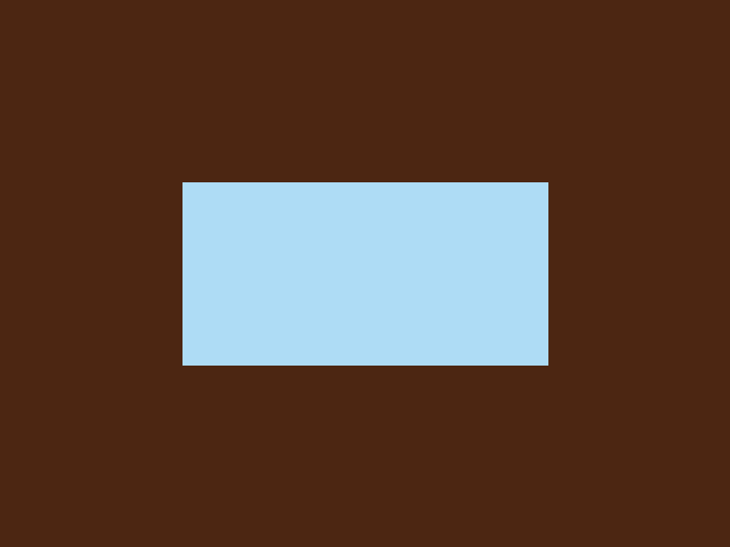
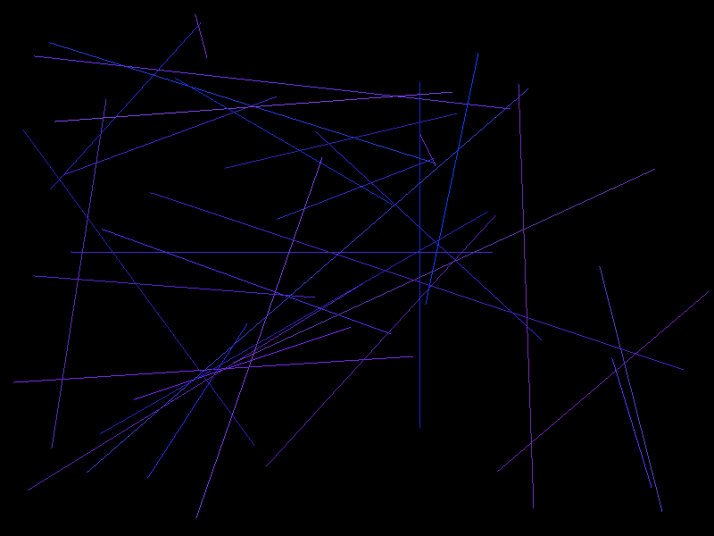
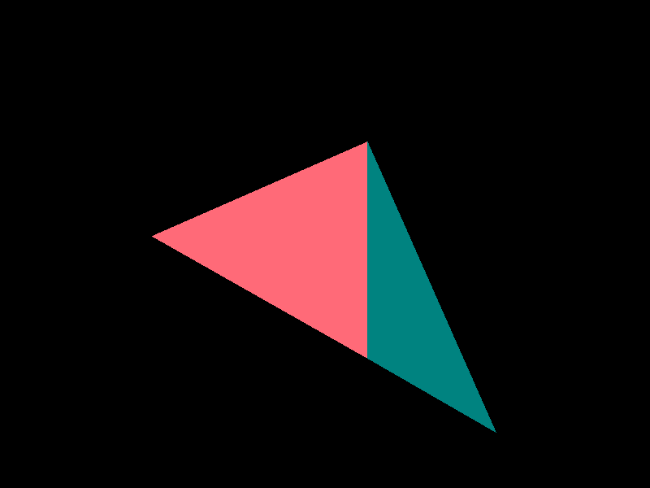

# RSRL
This project is still WIP.

## Progress
* [x] Basis (`Color`, `Vector`, `Matrix`, etc.)
* [x] Viewer Window
* [x] Texture
* [ ] Renderer (At pixels level)
    * [x] Pixel drawing
    * [x] Line rasterization
    * [x] Triangle rasterization
    * [ ] Line clipping
* [ ] 2D Software Rendering
* [ ] 3D Software Rendering

## Try it
**NOTICE**: Only tested on Ubuntu 16.04. Other platforms may not work.

1. make sure you have installed SDL2 and cmake (>= 2.6). If you haven't install it, use `apt-get` to install.

```shell
sudo apt-get install libsdl2-dev libsdl2-image-dev cmake
```
2. Clone this repo, prepare to build:

```shell
git clone https://github.com/riteme/RSRL.git
cd RSRL
mkdir build
cd build
```

3. Generate Makefiles:

```shell
cmake ..
```

If you want to build RSRL's tests (in `tests` folder), please add `-DBUILD_TESTS=ON` to the end of command line.
To build with debugging symbols, add `-DDEBUG=ON`.

4. Compile it:

```shell
make
```

If no error reported, RSRL should be compiled successfully.

Avaliable tests with a display window (which means you can have fun with them):

```
TextureTest
DrawLineTest
DrawTriangleTest
```

If you have built with `-DBUILD_TESTS=ON`, you will found them in `build` folder.

## Screenshots
### TextureTest


### DrawLineTest


### DrawTriangleTest

